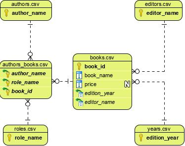
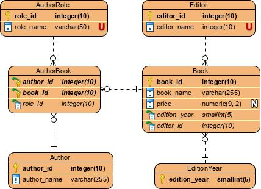

# Назначение

Скрипт для сбора сведений о каталоге интернет-магазина читай-город с последующим сохранением в формате .csv и подготовки к загрузке в базу данных под управлением PostgreSQL.

# Структура репозитория

- `requirements.txt` – перечень зависимостей
- `main.py` – скрипт для сбора данных и сохранении в формате csv. При запуске получает каталог интернет-магазина и сохраняет результаты в виде нескольких файлов в формате csv в созданной директории, названной соответственно дате выполнения в формате “ДД.ММ.ГГГГ_ЧЧ.ММ.СС”
- `data/` – директория с демонстрационными данными, готовыми к загрузке в БД файлами от 06.08.2020.
- `db` – скрипты sql для загрузки данных в БД и демонстрационные запросы.
...- `to_database.sql` - преобразование результатов выполнения main.py для загрузки в БД, результат сохраняется в нескольких .csv файлах
...- `queries.sql` – несколько демонстрационных запросов к каталогу после загрузки в БД

# Структура csv файлов с данными

## authors.csv 
перечень присутствующих в каталоге писателей
- `author_name` – Фамилия и инициалы автора, уникально в рамках файла

## years.csv
перечень всех лет в промежутке от самого раннего и самого позднего года из каталога, может включать отсутствующие в каталоге годы.
- `edition_year` – уникальное обозначение года издания

## editors.csv
перечень заявленных на главной странице читай-города издательств
- `editor_name` – уникальное название издательства

## books.csv
присутствующие в каталоге книги
- `book_id` – уникальный идентификатор книги (идентификатор продукта на сайте интернет-магазина)
- `book_name` – название книги, не уникально, книги с различными идентификаторами могут иметь одинаковые названия
- `price` – стоимость книги, указана не для всех книг
- `edition_year` – год издания книги, ссылка на years.csv 
- `editor_name` – наименование издавшего книгу издательства, ссылка на editors.csv

## roles.csv
присутствующие в каталоги роли лиц, участвовавших в написании и подготовке книги к изданию
- `role_name` – уникальное обозначение роли

## authors_books.csv
соотношение автора, книги и его роли при издании книги
- `author_name` - Фамилия и инициалы автора, ссылка на authors.csv
- `book_id` - уникальный идентификатор книги, ссылка на books.csv
- `role_name` - уникальное обозначение роли, ссылка на roles.csv
 

# Структура базы данных

Структура БД во многом повторяет структуру взаимосвязей csv файлов, за некоторыми исключениями

## Author
перечень присутствующих в каталоге писателей
- `author_id` – уникальный идентификатор автора (генерируется при вставке)
- `author_name` – Фамилия и инициалы автора, уникально в рамках файла

## EditionYear
перечень всех лет в промежутке от самого раннего и самого позднего года из каталога, может включать отсутствующие в каталоге годы.
- `edition_year` – уникальное обозначение года издания 

## Editor
перечень заявленных на главной странице читай-города издательств
- `editor_id` – уникальный идентификатор издателя (генерируется при вставке)
- `editor_name` – уникальное название издательства

## Book
присутствующие в каталоге книги
- `book_id` – уникальный идентификатор книги (идентификатор продукта на сайте интернет-магазина)
- `book_name` – название книги, не уникально, книги с различными идентификаторами могут иметь одинаковые названия
- `price` – стоимость книги, указана не для всех книг
- `edition_year` – год издания книги, ссылка на EditionYear(edition_year) 
- `editor_id` – наименование издавшего книгу издательства, ссылка на Editor(editor_id)

## AuthorRole
присутствующие в каталоги роли лиц, участвовавших в написании и подготовке книги к изданию
- `role_id` – уникальный идентификатор роли (генерируется при вставке)
- `role_name` – уникальное обозначение роли

## AuthorBook – соотношение автора, книги и его роли при издании книги
- `author_id` - уникальный идентификатор автора, ссылка на Author(author_id)
- `book_id` - уникальный идентификатор книги, ссылка на Book(book_id)
- `role_id` - уникальный идентификатор роли, ссылка на AuthorRole(role_id)
